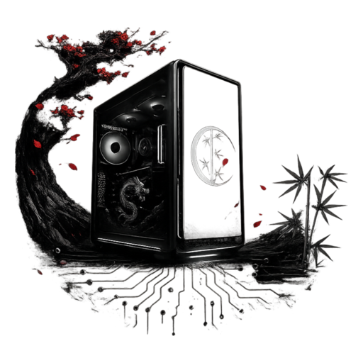
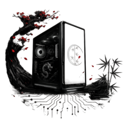

<div align="center">



# PC Insight

**Тихий, быстрый и красивый взгляд внутрь вашего компьютера**

Характеристики, температуры, телеметрия и здоровье железа — в одном окне.

`Tauri v2` · `React 19` · `TypeScript 5.8` · `Vite 7` · `Rust`

Версия **1.3.0** · Русский и English · Светлая и тёмная темы

</div>

---

## Что это

PC Insight — настольное приложение для Windows, которое собирает полную картину по железу
и системе: от кэша процессора и партномеров планок памяти до износа SSD
и оборотов вентиляторов. Без рекламы, без телеметрии наружу, без установщиков-монстров:
одно окно весом в несколько мегабайт.

## Главное

| | |
| --- | --- |
| ⚡ **Живые данные** | Метрики обновляются каждые 1,5 с, датчики — каждые 5 с. Никаких кнопок «Обновить» |
| 🌡 **Температуры и кулеры** | Только идентифицированные узлы: CPU, GPU, VRM, Chipset, SSD, RAM, плата |
| 🎮 **Телеметрия GPU** | Загрузка, температура, видеопамять, потребление, частота, обороты |
| 💽 **S.M.A.R.T.** | Здоровье, наработка, циклы включения, остаточный ресурс SSD, ошибки ввода-вывода |
| 🧱 **Честные спеки** | Кэш L2/L3, сокет, полный объём видеопамяти без ограничения в 4 ГБ |
| 🧾 **Отчёт** | Вся конфигурация в текстовом файле в один клик |
| 🌐 **Два языка** | Русский и английский переключаются мгновенно, рядом с темой |
| 🪟 **Своё окно** | Собственный титлбар без системной рамки и собственная иконка |

## Разделы

**Обзор** — кольца нагрузки, память, хранилище, GPU, графики ЦП и сети, самые горячие узлы.

**Процессор** — модель, вендор, архитектура, сокет, ядра и потоки, текущая и максимальная
частота, кэш L2 и L3, виртуализация, покадровая нагрузка и история.

**Память** — объём, занятость, файл подкачки и таблица планок: слот, тип, форм-фактор,
частота, производитель, партномер.

**Видеокарта** — адаптеры, видеопамять, драйвер и его дата, разрешение, мониторы
и живая телеметрия.

**Накопители** — тома с занятостью и физические диски с S.M.A.R.T.

**Датчики** — температуры и обороты вентиляторов с метками узлов.

**Сеть** — интерфейсы, скорость приёма и передачи, суммарный трафик, график нагрузки.

**Процессы** — топ по процессору и памяти с PID.

**Система** — издание Windows, версия и сборка, дата установки и возраст системы,
последний запуск, локаль и часовой пояс, компьютер и домен, плата, BIOS, Secure Boot.

## Фильтр датчиков

Сырые данные с материнской платы полны безымянных значений вроде `Temperature #7`.
Приложение показывает только те датчики, которые удалось отнести к реальному узлу,
и подписывает каждый меткой:

`CPU` · `GPU` · `VRM` · `Chipset` · `SSD` · `HDD` · `RAM` · `Board` · `Network` · `Water` · `Case` · `Battery`

Вентиляторы с нулевыми оборотами и неопознанные каналы в список не попадают.

## Откуда берутся данные

| Данные | Источник |
| --- | --- |
| Нагрузка, память, процессы, сеть | `sysinfo` (Rust) |
| Windows, плата, BIOS, планки, GPU | PowerShell + WMI/CIM и реестр |
| Температуры и вентиляторы | `root\LibreHardwareMonitor`, `root\OpenHardwareMonitor`, фолбэк `MSAcpi_ThermalZoneTemperature` |
| Телеметрия GPU | `nvidia-smi` для NVIDIA, счётчики производительности для AMD и Intel |
| S.M.A.R.T. | `MSFT_PhysicalDisk` + `Get-StorageReliabilityCounter` |

### Про температуры честно

Windows не отдаёт показания чипов датчиков напрямую, а вкладывать `LibreHardwareMonitorLib.dll`
в дистрибутив нельзя: библиотеке нужен собственный драйвер кольца 0.
Поэтому PC Insight читает уже опубликованные значения из WMI-пространства
**LibreHardwareMonitor** или **OpenHardwareMonitor** — достаточно держать любую из них
запущенной в фоне. Если их нет, используется ACPI-термозона, а раздел «Датчики»
подскажет, что делать.

### Права администратора

S.M.A.R.T. и часть полей SMBIOS читаются только с повышенными правами.
Приложение прекрасно работает и без них — просто показывает кнопку перезапуска
через UAC там, где это действительно нужно.

## Быстрый старт

```bash
npm install
npm run tauri dev
```

## Сборка релиза

```bash
npm run tauri build
```

Установщики `.msi` и `.exe` появятся в `src-tauri/target/release/bundle`.

## Структура

```text
PC Insight/
├─ public/                 логотип и favicon
├─ src/
│  ├─ components/          Titlebar и набор иконок
│  ├─ lib/                 типы, форматтеры, словари ru/en
│  ├─ App.tsx              девять разделов интерфейса
│  └─ App.css              токены тем и все стили
└─ src-tauri/
   ├─ icons/               иконки приложения
   └─ src/
      ├─ lib.rs            команды Tauri и сбор данных
      ├─ winprobe.ps1      конфигурация Windows
      └─ sensors.ps1       датчики, GPU и S.M.A.R.T.
```

## Требования

- Windows 10 или 11
- Node.js 18+
- Rust stable и Microsoft Visual C++ Build Tools
- WebView2 Runtime (в Windows 11 уже есть)

<div align="center">
<br>

<br><br>
<sub>PC Insight · версия 1.3.0</sub>
</div>
